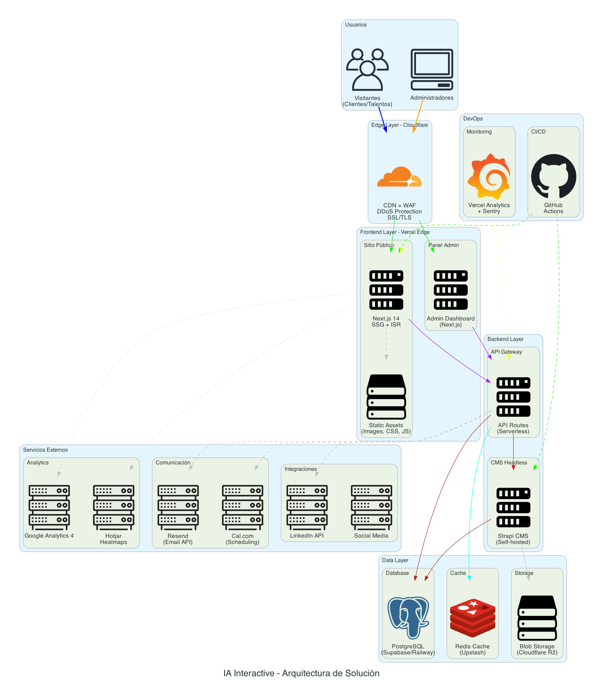

# SA Blueprints - IA Interactive Website Architecture

## 📋 Descripción

Propuesta de arquitectura técnica para el rediseño del sitio web de **IA interactive®**, una agencia de transformación digital con más de 25 años de experiencia.

## 🎯 Objetivo

Diseñar una solución escalable, eficiente en costos y de alto rendimiento que permita:
- Atraer nuevos clientes
- Reclutar talento
- Mejorar la experiencia de usuario
- Incrementar la interacción con el contenido

## 📁 Estructura del Proyecto

```
sa-blueprints/
├── diagrams/                        # Diagramas de arquitectura (Python + Diagrams)
│   ├── main_architecture.py         # Diagrama principal
│   ├── data_flow.py                 # Flujo de datos
│   ├── security_layers.py           # Capas de seguridad
│   └── output/                      # Imágenes PNG generadas
│       ├── ia_interactive_architecture.png
│       ├── ia_interactive_data_flow.png
│       └── ia_interactive_security.png
├── docs/                            # Documentación de la propuesta
│   ├── propuesta-tecnica.md         # 📄 Documento técnico principal
│   ├── resumen-ejecutivo.md         # 📊 Resumen para stakeholders
│   ├── estimacion-costos.md         # 💰 Desglose de costos
│   └── glosario.md                  # 📖 Glosario de términos
├── presentation/                    # Materiales de presentación
│   └── slides-outline.md            # 🎤 Estructura de slides
├── requirements.txt                 # Dependencias Python
├── .gitignore
└── README.md
```

## 📚 Documentación por Audiencia

| Documento | Audiencia | Descripción |
|-----------|-----------|-------------|
| [Propuesta Técnica](docs/propuesta-tecnica.md) | Arquitectos, Desarrolladores | Documento completo con todos los detalles técnicos |
| [Resumen Ejecutivo](docs/resumen-ejecutivo.md) | Directivos, PMs, Stakeholders | Versión resumida sin jerga técnica |
| [Estimación de Costos](docs/estimacion-costos.md) | Finanzas, PMs | Desglose detallado de costos por servicio |
| [Glosario](docs/glosario.md) | Todos | Definición de términos técnicos |

## 🚀 Quick Start

```bash
# Crear entorno virtual
python3 -m venv venv
source venv/bin/activate  # Linux/Mac
# o: .\venv\Scripts\activate  # Windows

# Instalar dependencias
pip install -r requirements.txt

# Generar diagramas
cd diagrams
python main_architecture.py
```

## 🛠️ Stack Tecnológico Propuesto

| Componente | Tecnología | Justificación |
|------------|------------|---------------|
| Frontend | Next.js 14 | SSG, ISR, SEO optimizado, i18n nativo |
| CMS | Strapi / Sanity | Headless, API-first, self-hosted option |
| Database | PostgreSQL | Relacional, robusto, económico |
| Hosting | Vercel | Edge network, 99.99% uptime, DX excelente |
| CDN | Cloudflare | Caché, WAF, DDoS protection, gratuito |
| Analytics | GA4 + Hotjar | Métricas completas + heatmaps |
| Email | Resend | Developer-friendly, tier gratuito |
| Scheduling | Cal.com | Open source, personalizable |

## 📊 Diagrama de Arquitectura



## 📄 Entregables

### Documento de Propuesta (Deadline: 30 Nov)
1. **[Propuesta Técnica](docs/propuesta-tecnica.md)** - Documento completo de la solución
2. **[Resumen Ejecutivo](docs/resumen-ejecutivo.md)** - Para stakeholders no técnicos
3. **[Estimación de Costos](docs/estimacion-costos.md)** - Desglose de infraestructura
4. **[Glosario](docs/glosario.md)** - Términos técnicos definidos

### Diagramas de Arquitectura
5. **[Arquitectura Principal](diagrams/output/ia_interactive_architecture.png)** - Vista general
6. **[Flujo de Datos](diagrams/output/ia_interactive_data_flow.png)** - Cómo fluye la información
7. **[Capas de Seguridad](diagrams/output/ia_interactive_security.png)** - Stack de protección

### Presentación (Siguiente semana)
8. **[Outline de Slides](presentation/slides-outline.md)** - Estructura de la presentación

## 🔧 Exportar a PDF

Para exportar la propuesta a PDF:

```bash
# Opción 1: Usando Pandoc
pandoc docs/propuesta-tecnica.md -o Propuesta_IA_Interactive.pdf --pdf-engine=xelatex

# Opción 2: VS Code + extensión "Markdown PDF"
# Click derecho en el archivo .md → "Markdown PDF: Export (pdf)"

# Opción 3: Copiar a Google Docs/Notion y exportar
```

## ✅ Checklist de Entrega

- [x] Diagrama de arquitectura principal
- [x] Diagrama de flujo de datos
- [x] Diagrama de seguridad
- [x] Documento de propuesta técnica
- [x] Resumen ejecutivo
- [x] Estimación de costos
- [x] Glosario de términos
- [x] Outline de presentación
- [ ] Exportar a PDF
- [ ] Enviar por correo

---

**Autor:** Jorge  
**Fecha:** Noviembre 2025  
**Para:** IA interactive® - Prueba Técnica Solutions Architecture

