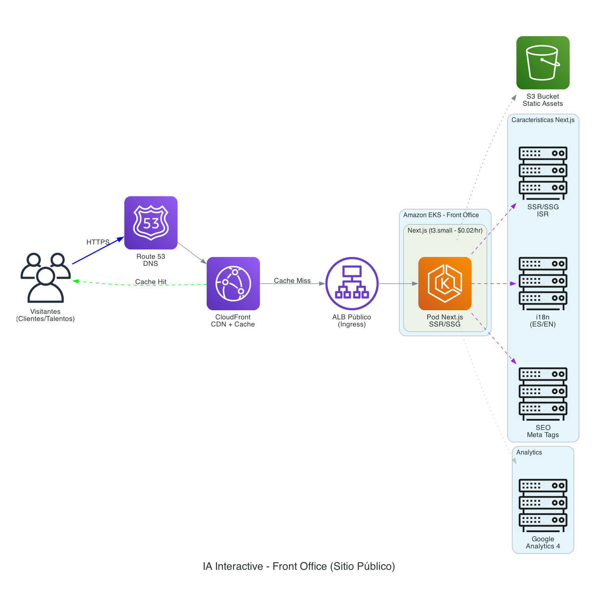
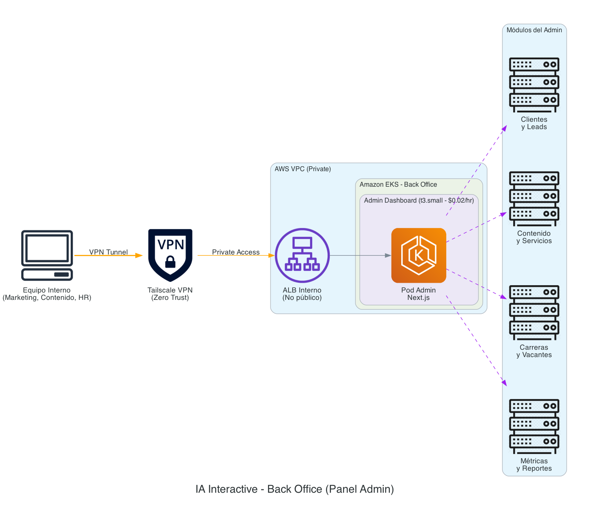
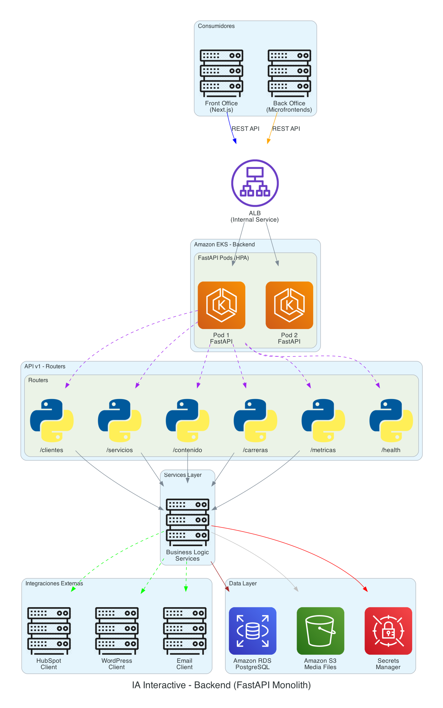
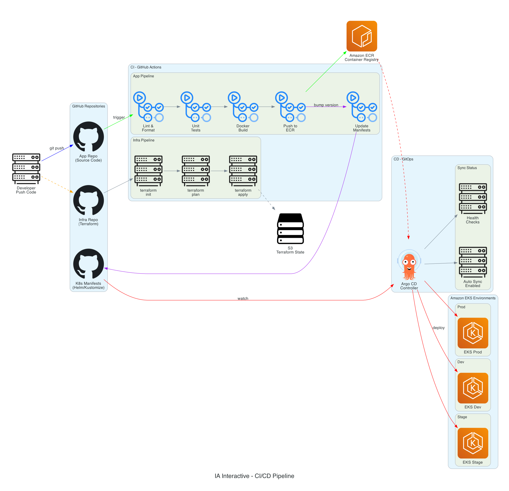

# AWS EKS Architecture - IA Interactive®

## 📋 Descripción

Arquitectura empresarial basada en **Amazon EKS (Kubernetes)** con:
- **Front Office**: Sitio público Next.js
- **Back Office**: Panel admin con Microfrontends
- **Backend**: Monolito FastAPI
- **Observabilidad**: Prometheus + Grafana
- **CI/CD**: GitHub Actions + Argo CD (GitOps)

## 📁 Estructura

```
aws-eks-architecture/
├── diagrams/
│   ├── 01_complete_architecture.py    # Vista general
│   ├── 02_front_office.py             # Sitio público
│   ├── 03_back_office.py              # Panel admin
│   ├── 04_backend.py                  # API FastAPI
│   ├── 05_kubernetes.py               # Cluster EKS
│   ├── 06_observability.py            # Monitoreo
│   ├── 07_cicd.py                     # Pipeline CI/CD
│   └── output/                        # Imágenes PNG
│       ├── 01_ia_complete_architecture.png
│       ├── 02_front_office.png
│       ├── 03_back_office.png
│       ├── 04_backend.png
│       ├── 05_kubernetes.png
│       ├── 06_observability.png
│       └── 07_cicd.png
├── docs/
│   └── estimacion-costos-aws.md       # Costos detallados
└── README.md
```

## 🖼️ Diagramas Generados

### 1. Arquitectura Completa


### 2. Front Office (Sitio Público)


### 3. Back Office (Panel Admin)


### 4. Backend (FastAPI)


### 5. Kubernetes (EKS)


### 6. Observabilidad


### 7. CI/CD Pipeline


## 💰 Estimación de Costos

| Ambiente | Mensual | Anual |
|----------|---------|-------|
| Development | ~$150-250 | ~$1,800-3,000 |
| Staging | ~$200-350 | ~$2,400-4,200 |
| Production | ~$400-800 | ~$4,800-9,600 |
| **TOTAL** | **~$750-1,400** | **~$9,000-16,800** |

Ver desglose completo: [estimacion-costos-aws.md](docs/estimacion-costos-aws.md)

## 🛠️ Stack Tecnológico

| Capa | Tecnología |
|------|------------|
| **Frontend** | Next.js 14 (SSR/SSG) |
| **Backend** | FastAPI (Python) |
| **Database** | Amazon RDS PostgreSQL |
| **Container Orchestration** | Amazon EKS |
| **CDN** | Amazon CloudFront |
| **CI** | GitHub Actions |
| **CD** | Argo CD (GitOps) |
| **Monitoring** | Prometheus + Grafana |
| **VPN** | Tailscale |
| **IaC** | Terraform |

## 🚀 Regenerar Diagramas

```bash
# Desde el root del proyecto
cd aws-eks-architecture/diagrams
source ../../venv/bin/activate
python 01_complete_architecture.py
python 02_front_office.py
python 03_back_office.py
python 04_backend.py
python 05_kubernetes.py
python 06_observability.py
python 07_cicd.py
```

## 📚 Documentación Relacionada

- [Propuesta JAMstack (alternativa)](../docs/propuesta-tecnica.md)
- [Estimación Costos Serverless](../docs/estimacion-costos.md)

---

**Fecha:** Noviembre 2025  
**Para:** IA interactive® - Prueba Técnica Solutions Architecture

