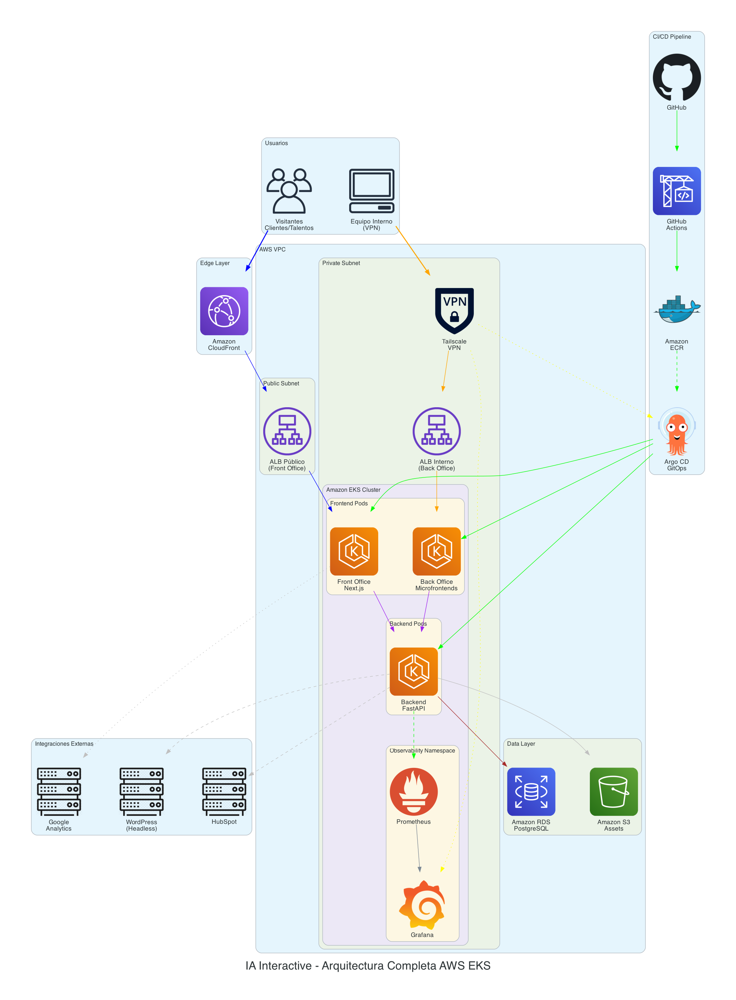
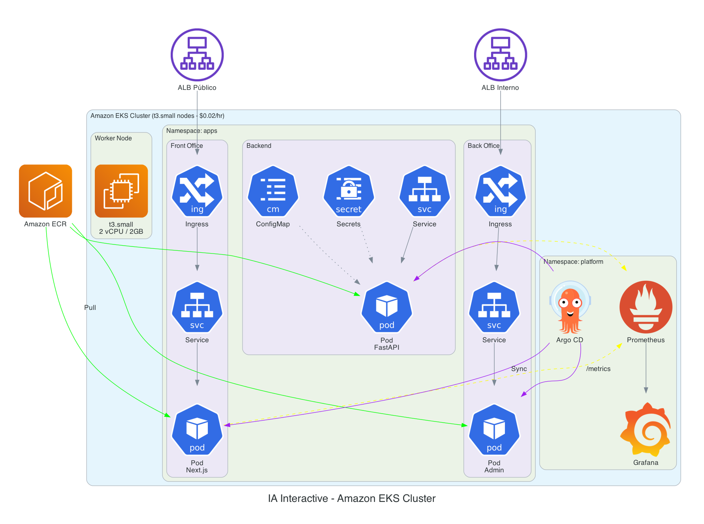
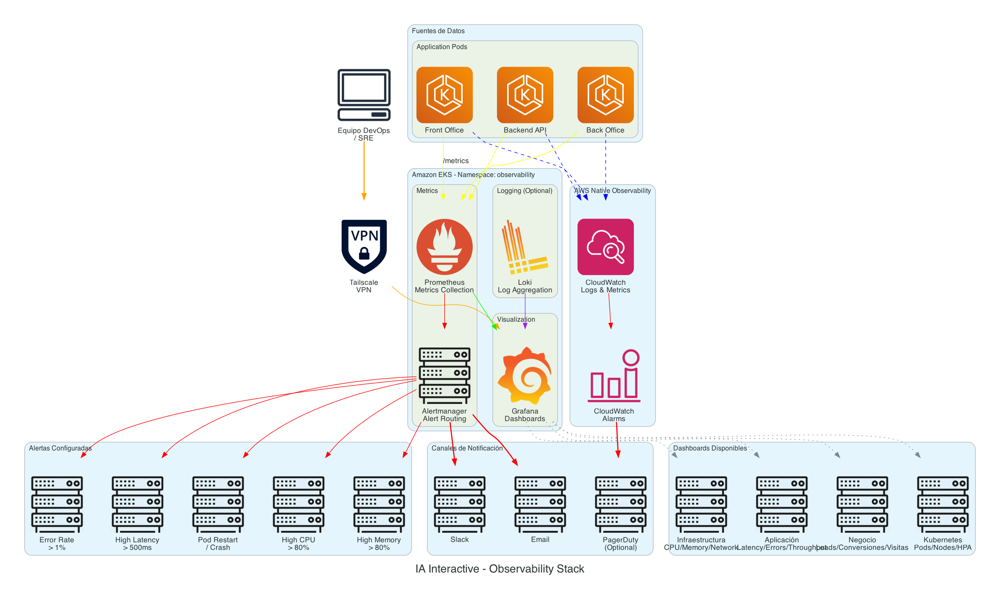

# AWS EKS Architecture

Arquitectura empresarial en AWS con Amazon EKS para una aplicacion web con front office publico y back office interno.

---

## Stack Tecnologico

| Componente | Tecnologia |
|------------|------------|
| Orquestacion | Amazon EKS |
| Frontend | Next.js (SSR/SSG) |
| Backend | FastAPI (Python) |
| Base de datos | Amazon RDS PostgreSQL |
| Storage | Amazon S3 |
| CDN | Amazon CloudFront |
| CI/CD | GitHub Actions + ArgoCD |
| Observabilidad | Prometheus + Grafana |
| VPN | Tailscale |

---

## Estructura

```
aws-eks-architecture/
├── src/
│   ├── 01-complete-architecture/
│   │   ├── diagram.py
│   │   └── output.png
│   ├── 02-front-office/
│   │   ├── diagram.py
│   │   └── output.png
│   ├── 03-back-office/
│   │   ├── diagram.py
│   │   └── output.png
│   ├── 04-backend/
│   │   ├── diagram.py
│   │   └── output.png
│   ├── 05-kubernetes/
│   │   ├── diagram.py
│   │   └── output.png
│   ├── 06-observability/
│   │   ├── diagram.py
│   │   └── output.png
│   └── 07-cicd/
│       ├── diagram.py
│       └── output.png
└── docs/
    ├── estimacion-costos-aws.md
    └── seccion-costos-latex.tex
```

---

## Diagramas

### 01 - Arquitectura Completa

Vista general de todos los componentes del sistema.



### 02 - Front Office

Flujo de usuarios publicos hacia el sitio web.


### 03 - Back Office

Acceso interno del equipo operativo via VPN.


### 04 - Backend

Servicios de backend y conexiones a datos.


### 05 - Kubernetes

Estructura del cluster EKS y sus namespaces.



### 06 - Observabilidad

Stack de monitoreo con Prometheus y Grafana.



### 07 - CI/CD

Pipeline de integracion y despliegue continuo.


---

## Generar Diagramas

```bash
cd sa-blueprints
source venv/bin/activate

# Generar un diagrama especifico
cd blueprints/aws-eks-architecture/src/01-complete-architecture
python diagram.py

# Generar todos
cd blueprints/aws-eks-architecture/src
for dir in */; do cd "$dir" && python diagram.py && cd ..; done
```

---

## Documentacion

- [Estimacion de Costos AWS](docs/estimacion-costos-aws.md)
