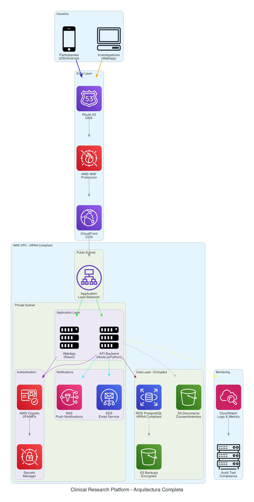

# Clinical Research Platform

Plataforma para gestion de estudios clinicos con aplicacion movil para participantes y webapp para investigadores.

---

## Objetivos

- Herramienta de apoyo a investigadores para mejorar adherencia a protocolos
- Mejorar retencion de pacientes en estudios clinicos
- Seguimiento seguro de participantes cumpliendo HIPAA

---

## Stack Tecnologico

| Componente | Tecnologia |
|------------|------------|
| Mobile App | React Native (iOS/Android) |
| WebApp | React |
| Backend | Node.js / Python |
| Database | PostgreSQL (RDS) |
| Cloud | AWS (HIPAA Compliant) |
| Auth | AWS Cognito (2FA/MFA) |
| Storage | S3 (Encrypted) |
| Notifications | SNS / SES |

---

## Estructura

```
clinical-research-platform/
├── src/
│   ├── 01-complete-architecture/
│   ├── 02-mobile-app/
│   ├── 03-webapp/
│   ├── 04-backend-infrastructure/
│   ├── 05-security-layers/
│   ├── 06-propuesta-simple/      # Fargate Simple
│   └── 07-propuesta-estandar/    # Fargate Multi-AZ
└── docs/
    ├── preguntas-cliente.md
    └── comparacion-propuestas.md
```

---

## Diagramas

### 01 - Arquitectura Completa

Vista general de la plataforma con todos los componentes.



### 02 - Mobile App (Participantes)

Aplicacion movil React Native para participantes de estudios clinicos.

Funcionalidades:
- Login seguro con biometricos
- Dashboard de estado del estudio
- Calendario de visitas
- Consentimiento informado digital (firma)
- Encuestas y formularios
- Chat seguro con investigadores
- Notificaciones push


### 03 - WebApp (Investigadores)

Panel de administracion para investigadores.

Funcionalidades:
- Dashboard con KPIs
- Gestion de protocolos y CRFs
- Enrolamiento de participantes
- Cronograma de visitas
- Recoleccion de datos
- Eventos adversos
- Reportes (CSV/Excel)
- Auditoria y compliance


### 04 - Infraestructura AWS

Infraestructura en AWS cumpliendo lineamientos HIPAA.

Componentes:
- VPC con subnets publicas y privadas
- ECS para contenedores
- RDS PostgreSQL con replica
- ElastiCache Redis
- S3 encrypted para documentos
- CloudWatch y CloudTrail


### 05 - Capas de Seguridad

Stack de seguridad para cumplimiento HIPAA.

Capas:
1. Edge Security (Shield, WAF, SSL/TLS)
2. Authentication (Cognito 2FA, IAM, RBAC)
3. Network Security (VPC, Private Subnets)
4. Application Security (Validation, Sessions)
5. Data Security (KMS, Encryption at Rest)
6. Audit & Compliance (CloudTrail, Audit Trail)


---

## Propuestas de Arquitectura

### 06 - Propuesta A: Fargate Basico

Arquitectura minima funcional y economica.

- Fargate (2 tareas)
- RDS Single-AZ
- Sin cache
- Costo: $200-350 USD/mes


### 07 - Propuesta B: Fargate + Seguridad

Arquitectura robusta con alta disponibilidad.

- Fargate con auto-scaling
- RDS Multi-AZ
- ElastiCache Redis
- WAF + CloudTrail
- Costo: $400-600 USD/mes


Ver comparacion completa: [docs/comparacion-propuestas.md](docs/comparacion-propuestas.md)

---

## Requisitos HIPAA

| Requisito | Implementacion |
|-----------|----------------|
| Encryption at Rest | KMS + RDS Encrypted + S3 Encrypted |
| Encryption in Transit | SSL/TLS |
| Access Control | Cognito + IAM + RBAC |
| Audit Logs | CloudTrail + Audit Trail |
| Data Backup | S3 Automated Backups |
| Network Isolation | VPC + Private Subnets |

---

## Equipo

- Coordinador: Mtro. Alfredo Pedroza Diaz
- Lider: Jonathan Arroyo Pilatowsky
- Programadores Sr: Dr. David Escobar, Ing. Inaki Siguenza
- Programadores Jr: Luis Cedillo, Mauricio Chavarria, Esteban Mayoral, Daniel Pelaez, Jorge Jimenez

---

## Timeline

Duracion: 9 meses
Metodologia: Agile con sprints semanales

---

## Documentacion

| Documento | Descripcion |
|-----------|-------------|
| [Preguntas para Cliente](docs/preguntas-cliente.md) | Preguntas de clarificacion de requerimientos |
| [Comparacion Propuestas](docs/comparacion-propuestas.md) | Simple vs Estandar con costos |

---

## Generar Diagramas

```bash
cd sa-blueprints
source venv/bin/activate

cd blueprints/clinical-research-platform/src/01-complete-architecture
python diagram.py
```
