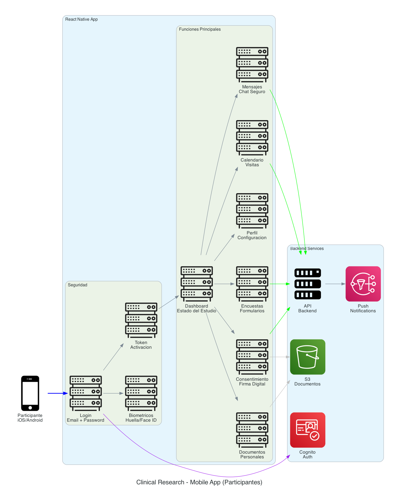
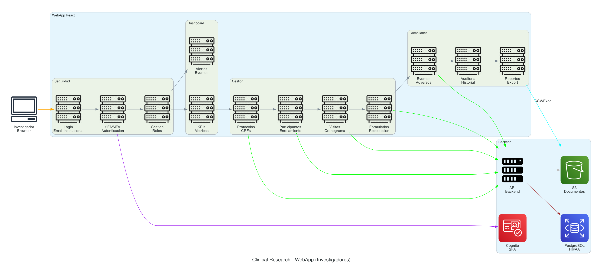
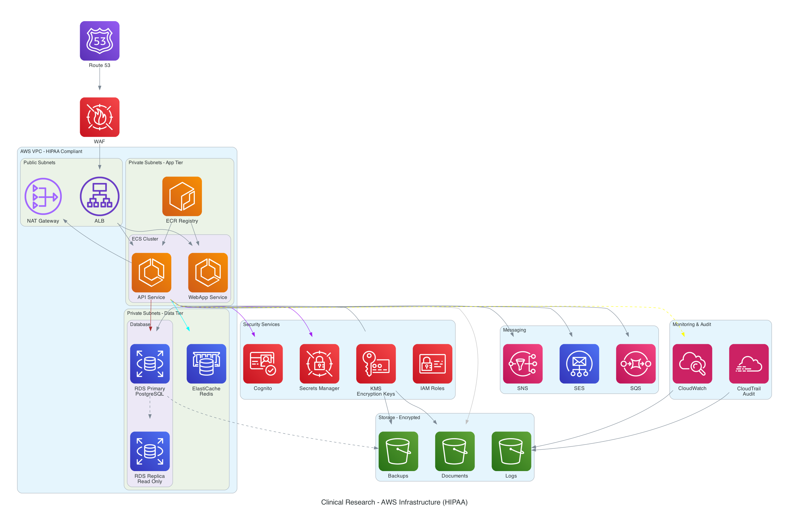
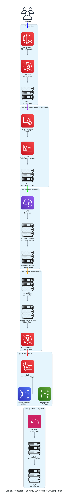
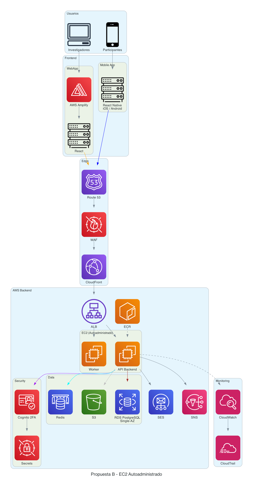

# Clinical Research Platform

Propuesta de Arquitectura

---

## Arquitectura General

Vista completa de la plataforma con todos los componentes.

Flujo:
1. Participantes acceden via Mobile App (React Native)
2. Investigadores acceden via WebApp (React + Amplify)
3. Route 53 resuelve DNS
4. CloudFront distribuye contenido estatico
5. ALB balancea trafico al backend
6. Backend procesa requests
7. Datos en RDS PostgreSQL y S3
8. Cognito maneja autenticacion
9. SNS/SES envian notificaciones

---

## Mobile App (Participantes)

Aplicacion movil React Native para iOS y Android.

Funcionalidades:
- Login seguro con opcion biometrica
- Dashboard de estado del estudio
- Calendario de visitas con confirmacion
- Consentimiento informado digital con firma
- Encuestas y formularios de seguimiento
- Chat seguro con investigadores
- Notificaciones push de recordatorios

---

## WebApp (Investigadores)

Panel de administracion web para el equipo de investigacion.

Funcionalidades:
- Dashboard con KPIs (estudios activos, pacientes, visitas)
- Gestion de protocolos y CRFs
- Enrolamiento y seguimiento de participantes
- Cronograma de visitas con colores
- Recoleccion de datos con validaciones
- Registro de eventos adversos
- Reportes exportables (CSV/Excel)
- Auditoria completa de acciones

---

## Backend Infrastructure

Infraestructura en AWS cumpliendo lineamientos HIPAA.

Componentes:
- VPC con subnets publicas y privadas
- Contenedores para el backend
- RDS PostgreSQL para datos
- ElastiCache Redis para cache
- S3 encriptado para documentos
- CloudWatch para monitoreo

---

## Capas de Seguridad

Stack de seguridad en capas para cumplimiento HIPAA.

| Capa | Componentes | Funcion |
|------|-------------|---------|
| 1. Edge | Shield, WAF, CloudFront | Proteccion DDoS y filtrado |
| 2. Auth | Cognito, IAM, RBAC | Autenticacion y autorizacion |
| 3. Network | VPC, Security Groups | Aislamiento de red |
| 4. Application | Validation, Sessions | Seguridad en codigo |
| 5. Data | KMS, Encryption | Proteccion de datos |
| 6. Audit | CloudTrail, Logs | Trazabilidad completa |

---

## Propuestas de Implementacion

Ambas propuestas incluyen seguridad completa. La diferencia es quien administra los servidores.

| Aspecto | Propuesta A (Fargate) | Propuesta B (EC2) |
|---------|----------------------|-------------------|
| Costo mensual | $350-500 USD | $300-450 USD |
| Compute | Fargate (serverless) | EC2 (autoadministrado) |
| Administracion | AWS | Ustedes |
| Base de datos | RDS Single-AZ | RDS Single-AZ |
| Cache | Redis | Redis |
| WAF | Si | Si |
| Audit Trail | CloudTrail | CloudTrail |
| Secrets Manager | Si | Si |

---

## Propuesta A - Fargate (Serverless)

AWS administra los servidores. Solo suben contenedores y escala automaticamente.

### Componentes

| Servicio | Configuracion |
|----------|---------------|
| Fargate | 2 tareas (0.5 vCPU, 1GB) |
| RDS PostgreSQL | db.t3.small Single-AZ |
| ElastiCache | cache.t3.micro Redis |
| WAF | Reglas basicas |
| Amplify | WebApp React |
| S3 | Standard |
| CloudFront | Con WAF |
| Cognito | User Pool + 2FA |
| Secrets Manager | Credenciales |
| CloudTrail | Auditoria |

### Costo Estimado

| Servicio | USD/mes |
|----------|---------|
| Fargate | $50-80 |
| RDS db.t3.small | $25-40 |
| ElastiCache | $15-25 |
| ALB | $20-30 |
| WAF | $10-20 |
| Amplify | $0-10 |
| S3 + CloudFront | $15-25 |
| Route 53 | $5 |
| Cognito | $0-50 |
| Secrets Manager | $5 |
| SNS/SES | $10-20 |
| CloudWatch + CloudTrail | $20-35 |
| **Total** | **$350-500** |

### Ventajas
- Sin administracion de servidores
- AWS parcha el OS automaticamente
- Escala automaticamente segun demanda
- Pay-per-use
- Seguridad completa (WAF, CloudTrail, Secrets)

### Desventajas
- Menos control sobre infraestructura
- No hay SSH a contenedores
- Costo ligeramente mayor

---

## Propuesta B - EC2 (Autoadministrado)

Ustedes administran los servidores. Control total con SSH.

### Componentes

| Servicio | Configuracion |
|----------|---------------|
| EC2 | 2x t3.small (API + Worker) |
| RDS PostgreSQL | db.t3.small Single-AZ |
| ElastiCache | cache.t3.micro Redis |
| WAF | Reglas basicas |
| Amplify | WebApp React |
| S3 | Standard |
| CloudFront | Con WAF |
| Cognito | User Pool + 2FA |
| Secrets Manager | Credenciales |
| CloudTrail | Auditoria |

### Costo Estimado

| Servicio | USD/mes |
|----------|---------|
| EC2 (2x t3.small) | $30-40 |
| RDS db.t3.small | $25-40 |
| ElastiCache | $15-25 |
| ALB | $20-30 |
| WAF | $10-20 |
| Amplify | $0-10 |
| S3 + CloudFront | $15-25 |
| Route 53 | $5 |
| Cognito | $0-50 |
| Secrets Manager | $5 |
| SNS/SES | $10-20 |
| CloudWatch + CloudTrail | $20-35 |
| **Total** | **$300-450** |

### Ventajas
- Control total (SSH, logs, configuracion)
- Costo ligeramente menor
- Pueden optimizar instancias
- Seguridad completa (WAF, CloudTrail, Secrets)

### Desventajas
- Ustedes parchean el OS
- Ustedes escalan manualmente
- Pagan 24/7 aunque no haya trafico

---

## Comparativa Final

| | Propuesta A (Fargate) | Propuesta B (EC2) |
|-|----------------------|-------------------|
| Quien administra | AWS | Ustedes |
| Parches de OS | Automatico | Manual |
| SSH a servidor | No | Si |
| Escalamiento | Automatico | Manual |
| Costo minimo | $350/mes | $300/mes |
| Costo tipico | $425/mes | $375/mes |
| **Anual estimado** | **$5,100** | **$4,500** |

---

## Recomendacion

**Propuesta A (Fargate)** si:
- Equipo pequeno sin DevOps dedicado
- Prefieren que AWS administre infraestructura
- Quieren escalamiento automatico
- No necesitan SSH a servidores

**Propuesta B (EC2)** si:
- Quieren control total sobre servidores
- Tienen experiencia administrando infraestructura
- Prefieren menor costo mensual
- Necesitan SSH para debugging
