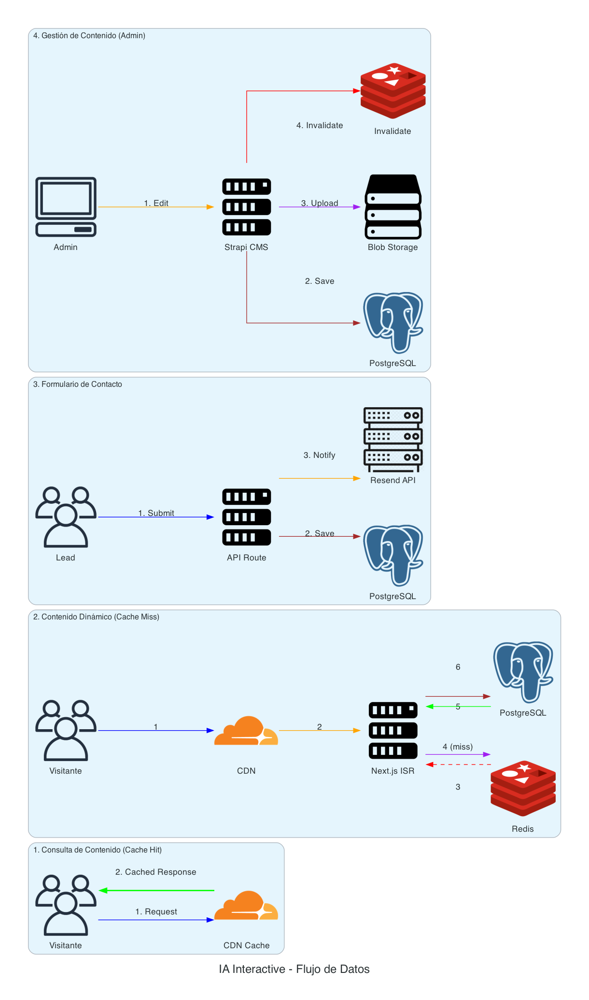

# IA Interactive Website

Arquitectura para sitio web corporativo de agencia de transformacion digital.

---

## Stack Tecnologico

| Componente | Tecnologia |
|------------|------------|
| Frontend | Next.js 14 (SSG/ISR) |
| CMS | Strapi (Headless) |
| Base de datos | PostgreSQL |
| Hosting | Vercel |
| CDN | Cloudflare |
| Cache | Redis (Upstash) |
| Analytics | GA4 + Hotjar |
| Email | Resend |

---

## Estructura

```
ia-interactive-website/
├── src/
│   ├── 01-main-architecture/
│   │   ├── diagram.py
│   │   └── output.png
│   ├── 02-data-flow/
│   │   ├── diagram.py
│   │   └── output.png
│   └── 03-security-layers/
│       ├── diagram.py
│       └── output.png
├── docs/
│   ├── propuesta-tecnica.md
│   ├── resumen-ejecutivo.md
│   ├── estimacion-costos.md
│   └── glosario.md
└── presentation/
    └── slides-outline.md
```

---

## Diagramas

### 01 - Arquitectura Principal

Vista general del sistema con todos los componentes.


### 02 - Flujo de Datos

Como fluye la informacion entre componentes.



### 03 - Capas de Seguridad

Stack de seguridad y proteccion.


---

## Generar Diagramas

```bash
cd sa-blueprints
source venv/bin/activate

cd blueprints/ia-interactive-website/src/01-main-architecture
python diagram.py
```

---

## Documentacion

- [Propuesta Tecnica](docs/propuesta-tecnica.md)
- [Resumen Ejecutivo](docs/resumen-ejecutivo.md)
- [Estimacion de Costos](docs/estimacion-costos.md)
- [Glosario](docs/glosario.md)
