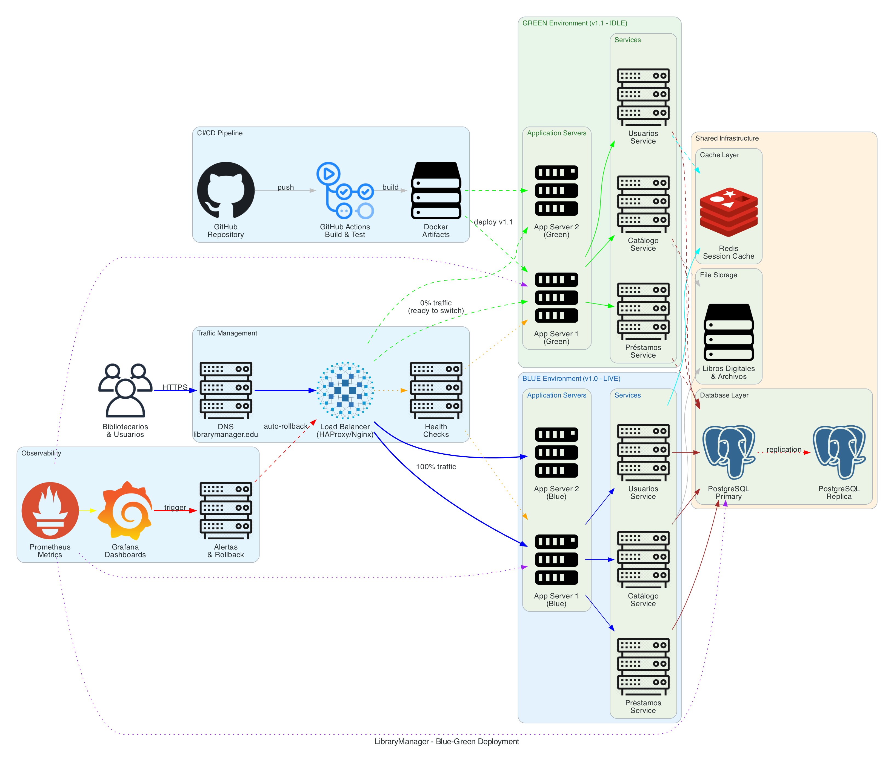
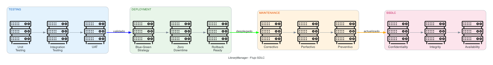

# Library Manager

Sistema de gestion de biblioteca con estrategia de deployment Blue-Green y ciclo SDLC.

---

## Enfoque

Este blueprint se centra en:

- Estrategia de deployment Blue-Green
- Ciclo de vida de desarrollo (SDLC)
- Zero downtime deployments
- Rollback instantaneo

---

## Estructura

```
library-manager/
└── src/
    ├── 01-blue-green-deployment/
    │   ├── diagram.py
    │   └── output.png
    ├── 02-blue-green-simple/
    │   ├── diagram.py
    │   └── output.png
    └── 03-sdlc-flow/
        ├── diagram.py
        └── output.png
```

---

## Diagramas

### 01 - Blue-Green Deployment (Completo)

Arquitectura completa con CI/CD, observabilidad y shared infrastructure.



### 02 - Blue-Green Deployment (Simple)

Version simplificada para documentos.


### 03 - SDLC Flow

Flujo del ciclo de vida: Testing, Deployment, Maintenance, SSDLC.



---

## Blue-Green Deployment

Estrategia que mantiene dos ambientes identicos:

| Ambiente | Estado | Trafico |
|----------|--------|---------|
| Blue | Produccion | 100% |
| Green | Staging | 0% |

Proceso:

1. Deploy nueva version a Green
2. Ejecutar validaciones y health checks
3. Switch de trafico via Load Balancer
4. Si hay problemas, rollback a Blue

Beneficios:

- Zero downtime
- Rollback instantaneo
- Testing en ambiente real

---

## Generar Diagramas

```bash
cd sa-blueprints
source venv/bin/activate

cd blueprints/library-manager/src/01-blue-green-deployment
python diagram.py
```
