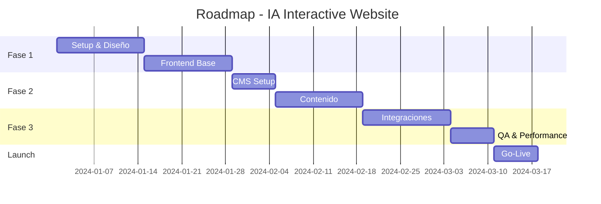

# Propuesta de Arquitectura Técnica
## Rediseño del Sitio Web - IA interactive®

---

## 📄 Información del Documento

| Campo | Valor |
|-------|-------|
| **Versión** | 1.0 |
| **Fecha de creación** | Noviembre 2025 |
| **Autor** | [Tu nombre] |
| **Estado** | Borrador para revisión |
| **Destinatario** | IA interactive® - Equipo de Arquitectura |
| **Clasificación** | Confidencial |

### Historial de Versiones

| Versión | Fecha | Autor | Cambios |
|---------|-------|-------|---------|
| 1.0 | Nov 2025 | [Tu nombre] | Versión inicial |

---

## 📋 Índice

1. [Resumen Ejecutivo](#resumen-ejecutivo)
2. [Diagrama de Arquitectura](#diagrama-de-arquitectura)
3. [Requerimientos Técnicos](#requerimientos-técnicos)
4. [Cumplimiento de Requerimientos de Negocio](#cumplimiento-de-requerimientos-de-negocio)
5. [Cumplimiento de Requerimientos Funcionales](#cumplimiento-de-requerimientos-funcionales)
6. [Cumplimiento de Requerimientos No Funcionales](#cumplimiento-de-requerimientos-no-funcionales)
7. [Consideraciones Adicionales](#consideraciones-adicionales)
8. [Estimación de Costos](#estimación-de-costos)
9. [Roadmap de Implementación](#roadmap-de-implementación)
10. [Riesgos y Mitigaciones](#riesgos-y-mitigaciones)
11. [Referencias y Recursos](#referencias-y-recursos)
12. [Anexos](#anexos)

---

## Resumen Ejecutivo

La presente propuesta define una arquitectura moderna basada en el paradigma **JAMstack** (JavaScript, APIs, Markup) que combina las ventajas de la generación estática con la flexibilidad del contenido dinámico. 

### Stack Principal Propuesto

| Capa | Tecnología | Justificación |
|------|------------|---------------|
| **Frontend** | Next.js 14 | SSG/ISR, App Router, SEO optimizado, i18n nativo |
| **CMS** | Strapi v4 | Headless, open-source, API REST/GraphQL |
| **Database** | PostgreSQL | Robusto, escalable, económico |
| **Hosting** | Vercel | Edge network global, 99.99% SLA |
| **CDN/Security** | Cloudflare | Caché, WAF, DDoS protection, SSL |
| **Cache** | Upstash Redis | Serverless, bajo costo |
| **Storage** | Cloudflare R2 | S3-compatible, sin egress fees |
| **Email** | Resend | API moderna, deliverability |
| **Scheduling** | Cal.com | Open-source, personalizable |
| **Analytics** | GA4 + Hotjar | Métricas + comportamiento |

### Ventajas Clave de la Arquitectura

1. **Costo-eficiente**: Aprovecha tiers gratuitos y pricing serverless
2. **Alto rendimiento**: Páginas pre-generadas + CDN global
3. **Escalable**: Sin servidores que administrar, escala automáticamente
4. **Seguro**: Múltiples capas de protección
5. **Mantenible**: Separación clara de responsabilidades

---

## Diagrama de Arquitectura


### Descripción de Componentes

#### Edge Layer (Cloudflare)
- **CDN**: Distribución global de contenido estático
- **WAF**: Firewall de aplicaciones web
- **DDoS Protection**: Mitigación de ataques distribuidos
- **SSL/TLS**: Certificados automáticos

#### Frontend Layer (Vercel)
- **Next.js 14**: Framework React con App Router
- **SSG (Static Site Generation)**: Páginas pre-generadas en build
- **ISR (Incremental Static Regeneration)**: Actualización de páginas sin redeploy
- **Edge Functions**: Lógica en el edge para baja latencia

#### Backend Layer
- **API Routes**: Endpoints serverless para formularios y datos
- **Strapi CMS**: Panel de administración de contenido

#### Data Layer
- **PostgreSQL**: Base de datos relacional principal
- **Redis (Upstash)**: Caché de consultas frecuentes
- **Cloudflare R2**: Almacenamiento de imágenes y assets

---

## Requerimientos Técnicos

### Lenguajes de Programación

| Lenguaje | Uso | Versión |
|----------|-----|---------|
| TypeScript | Frontend + API Routes | 5.x |
| JavaScript | Configuraciones | ES2022+ |
| SQL | Queries de base de datos | PostgreSQL 15 |

### Frameworks y Librerías

#### Frontend
```
next: ^14.0.0          # Framework React
react: ^18.2.0         # UI Library
tailwindcss: ^3.4.0    # Styling
next-intl: ^3.0.0      # Internacionalización
framer-motion: ^10.0.0 # Animaciones
react-hook-form: ^7.0.0 # Formularios
zod: ^3.22.0           # Validación
```

#### Backend (Strapi)
```
strapi: ^4.15.0        # CMS Headless
@strapi/plugin-i18n    # Soporte multiidioma
@strapi/plugin-users-permissions
pg: ^8.11.0            # Cliente PostgreSQL
```

### Bases de Datos

| Tipo | Tecnología | Proveedor | Propósito |
|------|------------|-----------|-----------|
| Relacional | PostgreSQL 15 | Supabase / Railway | Datos estructurados |
| Cache | Redis | Upstash | Cache de queries |
| Object Storage | S3-compatible | Cloudflare R2 | Imágenes y archivos |

### Plataformas y Servicios

| Servicio | Proveedor | Tier |
|----------|-----------|------|
| Frontend Hosting | Vercel | Pro |
| CMS Hosting | Railway | Starter |
| Database | Supabase | Pro |
| CDN + WAF | Cloudflare | Pro |
| Email | Resend | Free/Pro |
| Scheduling | Cal.com | Free/Team |
| Analytics | Google Analytics 4 | Free |
| Heatmaps | Hotjar | Basic |
| Error Tracking | Sentry | Team |
| Auth | NextAuth.js | Open Source |

### Herramientas de Desarrollo

| Herramienta | Propósito |
|-------------|-----------|
| GitHub | Versionamiento + CI/CD (Actions) |
| Vercel CLI | Deploy + Preview |
| Docker | Desarrollo local Strapi |
| Postman/Insomnia | Testing de APIs |
| Figma | Diseño (handoff) |

---

## Cumplimiento de Requerimientos de Negocio

### 1. Atracción e incremento de nuevos clientes

| Estrategia Técnica | Implementación |
|-------------------|----------------|
| **SEO Optimizado** | Next.js genera meta tags dinámicos, sitemap.xml automático, Schema.org markup |
| **Core Web Vitals** | SSG + ISR garantizan LCP < 2.5s, FID < 100ms, CLS < 0.1 |
| **Social Sharing** | Open Graph y Twitter Cards dinámicos por página |
| **CTA Efectivos** | Formulario de contacto optimizado con validación en tiempo real |
| **Analytics Avanzados** | Tracking de conversiones con GA4 + eventos personalizados |

### 2. Atracción de nuevos talentos

| Estrategia Técnica | Implementación |
|-------------------|----------------|
| **Sección Carreras** | CMS dedicado para gestión de vacantes |
| **Aplicación Simplificada** | Integración directa con LinkedIn Easy Apply |
| **Cultura Visible** | Galería y videos de "Vida en IA" con lazy loading |
| **ATS Integration** | Webhook para enviar aplicaciones a sistema de tracking |

### 3. Mejora de experiencia de usuario

| Estrategia Técnica | Implementación |
|-------------------|----------------|
| **Performance** | Tiempo de carga < 1s con SSG + Edge caching |
| **Responsive Design** | Mobile-first con Tailwind CSS |
| **Accesibilidad** | WCAG 2.1 AA compliance |
| **Navegación Intuitiva** | App Router con transiciones suaves |
| **Multiidioma** | Switch ES/EN instantáneo sin recarga |

### 4. Mayor interacción y recurrencia

| Estrategia Técnica | Implementación |
|-------------------|----------------|
| **Casos de Éxito** | Sección dinámica con filtros y búsqueda |
| **Blog/Recursos** | Contenido periódico gestionable desde CMS |
| **Newsletter** | Integración con servicio de email marketing |
| **Social Proof** | Integración de feeds de redes sociales |
| **Notificaciones** | Web push para nuevas vacantes (opcional) |

---

## Cumplimiento de Requerimientos Funcionales

### Sitio Web Público

#### 1. Información General de IA interactive®

```
Estructura de Contenido en Strapi:

├── Collection Types
│   ├── Clients (clientes principales)
│   ├── CaseStudies (casos de éxito)
│   ├── Services (servicios)
│   ├── Jobs (vacantes)
│   ├── TeamMembers (opcional)
│   └── Contacts (formularios recibidos)
│
├── Single Types
│   ├── AboutUs (quiénes somos)
│   ├── WorkMethodology (forma de trabajo)
│   ├── CompanyHistory (historia)
│   └── CompanyCulture (vida en IA)
```

| Sección | Tipo CMS | Campos Clave |
|---------|----------|--------------|
| Quiénes somos | Single Type | título, descripción, misión, visión, valores |
| Clientes | Collection | nombre, logo, industria, destacado |
| Casos de éxito | Collection | título, cliente, reto, solución, resultados, imágenes |
| Servicios | Collection | nombre, descripción, icono, características |
| Forma de trabajo | Single Type | etapas, descripción por etapa |
| Carreras - Vida | Single Type | descripción, beneficios, galería |
| Carreras - Vacantes | Collection | título, área, modalidad, requisitos, responsabilidades |
| Historia | Single Type | timeline con hitos |

#### 2. Multiidioma (ES/EN)

```typescript
// Implementación con next-intl
// middleware.ts
import createMiddleware from 'next-intl/middleware';

export default createMiddleware({
  locales: ['es', 'en'],
  defaultLocale: 'es',
  localePrefix: 'as-needed'
});

// Strapi: Plugin i18n habilitado en todos los content types
// Cada entrada tiene versiones en español e inglés
```

**Flujo de internacionalización:**
1. URL `/es/servicios` → Contenido en español
2. URL `/en/services` → Contenido en inglés
3. Switch de idioma mantiene la página actual
4. Preferencia guardada en cookie

#### 3. Contacto

| Canal | Implementación |
|-------|----------------|
| **Formulario** | React Hook Form + Zod validation + API Route → Strapi + Email |
| **Agendar cita** | Embed de Cal.com con estilos personalizados |
| **Redes sociales** | Links directos + Share buttons con tracking |

```typescript
// Flujo del formulario de contacto
async function handleSubmit(data: ContactForm) {
  // 1. Validar datos (client-side con Zod)
  // 2. POST a /api/contact
  // 3. Guardar en Strapi (collection Contacts)
  // 4. Enviar email de notificación (Resend)
  // 5. Enviar email de confirmación al usuario
  // 6. Tracking de conversión (GA4)
}
```

#### 4. Aplicar a Vacantes

| Método | Implementación |
|--------|----------------|
| **Email** | Botón mailto: con subject pre-llenado |
| **LinkedIn** | Botón de LinkedIn Easy Apply o redirect a posting |

```typescript
// Componente de aplicación
<JobApplication
  jobId={job.id}
  jobTitle={job.title}
  methods={['email', 'linkedin']}
  emailTo="careers@ia-interactive.com"
  linkedInUrl={job.linkedInUrl}
/>
```

### Sitio Administrador

#### 1. Gestión de Contenido (CMS Strapi)

**Panel de administración Strapi incluye:**
- ✅ Editor WYSIWYG para contenido rico
- ✅ Media Library para imágenes/archivos
- ✅ Roles y permisos (Editor, Admin)
- ✅ Preview de cambios
- ✅ Historial de versiones
- ✅ Publicación programada

**Secciones administrables:**
| Sección | Funcionalidades |
|---------|-----------------|
| Quiénes | Editar texto, imágenes, valores |
| Clientes | CRUD de clientes + casos de éxito |
| Servicios | CRUD con iconos y características |
| Carreras | CRUD de vacantes + contenido cultural |

#### 2. Visualización de Contactos

```typescript
// Dashboard en Next.js con datos de Strapi
// /admin/contacts

interface Contact {
  id: number;
  name: string;
  email: string;
  company: string;
  message: string;
  source: 'form' | 'calendar';
  status: 'new' | 'contacted' | 'converted';
  createdAt: Date;
}

// Features:
// - Tabla con filtros y búsqueda
// - Export a CSV
// - Cambio de status
// - Notas internas
```

#### 3. Visualización de Citas Programadas

```typescript
// Integración con Cal.com API
// /admin/appointments

// Webhook de Cal.com → API Route → Guardar en Strapi
// Dashboard muestra calendario + lista de citas
```

#### 4. Estadísticas del Sitio

**Implementación con GA4 + Dashboard personalizado:**

| Métrica | Fuente | Implementación |
|---------|--------|----------------|
| Visitas | GA4 | Google Analytics Data API |
| Tasa de abandono | GA4 | Bounce rate por página |
| Visitas → Contacto | GA4 | Funnel con eventos personalizados |
| Visitas → Aplicación | GA4 | Evento `job_application_submit` |

```typescript
// Dashboard de Analytics (/admin/analytics)
// Usa Google Analytics Data API (GA4)

const metrics = await analyticsDataClient.runReport({
  property: `properties/${GA4_PROPERTY_ID}`,
  dateRanges: [{ startDate: '30daysAgo', endDate: 'today' }],
  metrics: [
    { name: 'screenPageViews' },
    { name: 'bounceRate' },
    { name: 'conversions' },
    { name: 'averageSessionDuration' },
  ],
});
```

---

## Cumplimiento de Requerimientos No Funcionales

### 1. Eficiencia (Optimización de Costos)

| Estrategia | Beneficio |
|------------|-----------|
| **Serverless-first** | Pago por uso, sin servidores ociosos |
| **SSG para contenido estático** | Reduce cómputo en runtime |
| **CDN caching agresivo** | Reduce requests al origin |
| **Tiers gratuitos estratégicos** | Cloudflare, GA4, Hotjar Basic |
| **Open source (Strapi, Cal.com)** | Sin licencias de software |
| **Cloudflare R2** | Sin costos de egress |

**Costo mensual estimado: $50-150 USD** (ver sección de costos)

### 2. Disponibilidad (95% anual)

| Componente | SLA Proveedor | Estrategia |
|------------|---------------|------------|
| Vercel | 99.99% | Edge network + automatic failover |
| Cloudflare | 100% | Anycast network + múltiples PoPs |
| Supabase | 99.9% | PostgreSQL replicado |
| Railway | 99.9% | Container orchestration |

**Disponibilidad combinada calculada: ~99.9%** (supera el 95% requerido)

**Estrategias de recuperación:**
- Páginas estáticas servidas desde CDN aunque el backend falle
- Health checks automáticos en Vercel
- Rollback automático ante deploys fallidos
- Stale-while-revalidate para datos cacheados

### 3. Performance (Caché)

```
Estrategia de Caché Multi-Nivel:

┌─────────────────────────────────────────────────────────────┐
│ Nivel 1: Browser Cache                                       │
│ - Static assets: Cache-Control: max-age=31536000            │
│ - HTML: Cache-Control: s-maxage=60, stale-while-revalidate  │
└─────────────────────────────────────────────────────────────┘
                              ▼
┌─────────────────────────────────────────────────────────────┐
│ Nivel 2: CDN Edge Cache (Cloudflare)                         │
│ - Páginas HTML: 1 hora con stale-while-revalidate           │
│ - Assets estáticos: 1 año con immutable                      │
│ - API responses: 5 minutos                                   │
└─────────────────────────────────────────────────────────────┘
                              ▼
┌─────────────────────────────────────────────────────────────┐
│ Nivel 3: Application Cache (Redis/Upstash)                   │
│ - Queries frecuentes a Strapi                                │
│ - Resultados de API externas                                 │
│ - Sesiones de usuario                                        │
└─────────────────────────────────────────────────────────────┘
                              ▼
┌─────────────────────────────────────────────────────────────┐
│ Nivel 4: Database Query Cache (PostgreSQL)                   │
│ - Prepared statements                                        │
│ - Connection pooling (Supabase)                              │
└─────────────────────────────────────────────────────────────┘
```

**Métricas esperadas:**
- First Contentful Paint (FCP): < 1.0s
- Largest Contentful Paint (LCP): < 1.5s
- Time to Interactive (TTI): < 2.0s
- Core Web Vitals: ✅ Pass

### 4. Mantenibilidad

| Aspecto | Estrategia |
|---------|------------|
| **Código modular** | Componentes React reutilizables + design system |
| **TypeScript** | Type safety reduce bugs en producción |
| **Documentación** | Storybook para componentes + JSDoc |
| **Testing** | Jest + React Testing Library + Playwright |
| **CI/CD automatizado** | GitHub Actions → Preview → Production |
| **Monitoreo** | Sentry para errores + Vercel Analytics |
| **Logs estructurados** | Pino logger con contexto |

```yaml
# Flujo de CI/CD (.github/workflows/deploy.yml)
on:
  push:
    branches: [main]
  pull_request:
    branches: [main]

jobs:
  test:
    - Lint (ESLint + Prettier)
    - Type check (TypeScript)
    - Unit tests (Jest)
    - E2E tests (Playwright)
  
  preview:
    - Deploy preview a Vercel (PRs)
  
  deploy:
    - Deploy producción (main)
    - Invalidar caché CDN
    - Notificar en Slack
```

### 5. Escalabilidad

| Escenario | Solución |
|-----------|----------|
| **Pico de tráfico** | Edge caching + serverless auto-scale |
| **Más contenido** | ISR regenera páginas incrementalmente |
| **Más usuarios admin** | Strapi escala horizontal en Railway |
| **Más regiones** | CDN global de Cloudflare (300+ PoPs) |

**Arquitectura preparada para escalar:**
- Sin estado en la aplicación (stateless)
- Base de datos con connection pooling
- Assets en object storage (R2)
- Funciones serverless (scale-to-zero)

### 6. Seguridad

#### Capas de Protección

```
┌────────────────────────────────────────────┐
│ 1. Edge (Cloudflare)                       │
│    ├─ DDoS Mitigation (L3/L4/L7)          │
│    ├─ WAF Rules (OWASP Top 10)            │
│    ├─ Bot Protection                       │
│    ├─ Rate Limiting                        │
│    └─ SSL/TLS 1.3                         │
├────────────────────────────────────────────┤
│ 2. Application (Vercel + Next.js)          │
│    ├─ Security Headers (CSP, HSTS, etc.)  │
│    ├─ CSRF Protection                      │
│    ├─ Input Validation (Zod)              │
│    └─ XSS Prevention (React escaping)     │
├────────────────────────────────────────────┤
│ 3. API (Strapi)                            │
│    ├─ Authentication (JWT)                 │
│    ├─ Authorization (RBAC)                 │
│    ├─ API Rate Limiting                    │
│    └─ Input Sanitization                   │
├────────────────────────────────────────────┤
│ 4. Data (Supabase/PostgreSQL)              │
│    ├─ Encryption at Rest (AES-256)        │
│    ├─ Encryption in Transit (TLS)         │
│    ├─ Row Level Security (RLS)            │
│    ├─ Automated Backups                    │
│    └─ Point-in-time Recovery              │
└────────────────────────────────────────────┘
```

#### Cumplimiento de Seguridad

| Control | Implementación |
|---------|----------------|
| **Integridad** | Checksums en archivos, validación de datos |
| **Confidencialidad** | Encryption at rest/transit, acceso por roles |
| **Autenticación** | NextAuth.js con OAuth 2.0 (admin) |
| **Autorización** | RBAC en Strapi + middleware en Next.js |
| **Auditoría** | Logs de acceso + cambios en contenido |
| **Backup** | Automáticos diarios con retención 30 días |

---

## Consideraciones Adicionales

### Eficiencia de Costos (Requisito Principal)

La arquitectura propuesta maximiza el uso de:

1. **Tiers gratuitos:**
   - Cloudflare Free (CDN básico)
   - Google Analytics 4 (gratuito)
   - Hotjar Basic (gratuito)
   - Cal.com Free (scheduling)
   - GitHub Free (repos + Actions)

2. **Pricing serverless:**
   - Vercel: Pago por bandwidth, no por servidor
   - Upstash: Pago por request
   - Railway: Pago por uso ($5/mes mínimo)

3. **Open source:**
   - Strapi CMS: Sin licencia
   - Next.js: Sin licencia
   - Cal.com: Sin licencia
   - Todas las librerías: MIT/Apache

### Tecnología Sin Limitantes

La propuesta no tiene vendor lock-in significativo:
- Next.js puede deployarse en cualquier plataforma Node.js
- Strapi puede moverse a cualquier servidor
- PostgreSQL es estándar
- Todo el código es portable

### Entrega de Valor Rápida

**Timeline sugerido (8-10 semanas):**

| Semana | Entregable |
|--------|------------|
| 1-2 | Setup inicial + diseño UI/UX |
| 3-4 | Frontend: páginas estáticas + i18n |
| 5-6 | CMS: Strapi + contenido inicial |
| 7-8 | Integraciones: Forms, Calendar, Analytics |
| 9 | QA + optimización de performance |
| 10 | Go-live + monitoreo |

---

## Estimación de Costos

Ver documento detallado: [estimacion-costos.md](./estimacion-costos.md)

### Resumen Mensual

| Escenario | Costo Mensual | Descripción |
|-----------|---------------|-------------|
| **Inicial (MVP)** | ~$50 USD | Tráfico bajo, tiers gratuitos |
| **Crecimiento** | ~$100-150 USD | Tráfico medio, features completos |
| **Escala** | ~$200-400 USD | Alto tráfico, enterprise features |

### Costo Anual Estimado (Fase Inicial)

```
Hosting Frontend (Vercel Pro):     $240/año
Hosting CMS (Railway):             $60/año
Database (Supabase Pro):           $300/año
CDN (Cloudflare Free→Pro):         $0-240/año
Email (Resend):                    $0-240/año
Otros (dominio, etc):              $50/año
─────────────────────────────────────────────
TOTAL ESTIMADO:                    $650-1,130/año
```

---

## Roadmap de Implementación



---

## Riesgos y Mitigaciones

| Riesgo | Probabilidad | Impacto | Mitigación |
|--------|--------------|---------|------------|
| Cambios en pricing de proveedores | Media | Medio | Arquitectura sin lock-in, fácil migración |
| Downtime de terceros | Baja | Alto | Fallbacks estáticos, múltiples proveedores |
| Picos de tráfico inesperados | Media | Medio | Edge caching, auto-scaling |
| Vulnerabilidades de seguridad | Baja | Alto | WAF, actualizaciones automáticas, auditorías |
| Complejidad de mantenimiento | Baja | Medio | Documentación, código modular, CI/CD |

---

## Conclusión

La arquitectura propuesta cumple con todos los requerimientos planteados:

✅ **Negocio**: SEO optimizado, UX moderna, analytics completos  
✅ **Funcionales**: CMS completo, multiidioma, formularios, scheduling  
✅ **No funcionales**: Económico, disponible, performante, seguro, escalable, mantenible  
✅ **Adicionales**: Costos optimizados, sin limitantes tecnológicas

La inversión en infraestructura es mínima (~$50-150/mes) con capacidad de escalar según necesidades futuras.

---

## Referencias y Recursos

### Documentación Oficial

| Tecnología | Documentación |
|------------|---------------|
| Next.js | https://nextjs.org/docs |
| Strapi | https://docs.strapi.io |
| Vercel | https://vercel.com/docs |
| Cloudflare | https://developers.cloudflare.com |
| Supabase | https://supabase.com/docs |
| Tailwind CSS | https://tailwindcss.com/docs |
| next-intl | https://next-intl-docs.vercel.app |

### Artículos y Guías Relevantes

1. **JAMstack Architecture**
   - https://jamstack.org/
   - Fundamentos del paradigma arquitectónico propuesto

2. **Core Web Vitals**
   - https://web.dev/vitals/
   - Métricas de Google para performance

3. **OWASP Top 10**
   - https://owasp.org/www-project-top-ten/
   - Principales vulnerabilidades de seguridad web

4. **12-Factor App**
   - https://12factor.net/
   - Metodología para aplicaciones modernas

### Herramientas de Evaluación

| Herramienta | Propósito | URL |
|-------------|-----------|-----|
| PageSpeed Insights | Performance | https://pagespeed.web.dev |
| WebPageTest | Performance detallado | https://webpagetest.org |
| Security Headers | Headers de seguridad | https://securityheaders.com |
| SSL Labs | Validar SSL/TLS | https://ssllabs.com/ssltest |

---

## Anexos

### Anexo A: Glosario de Términos

Para definiciones de términos técnicos utilizados en este documento, consultar:
- [Glosario de Términos](./glosario.md)

### Anexo B: Estimación Detallada de Costos

Desglose completo de costos por servicio y escenario:
- [Estimación de Costos](./estimacion-costos.md)

### Anexo C: Resumen Ejecutivo para Stakeholders

Versión resumida para audiencia no técnica:
- [Resumen Ejecutivo](./resumen-ejecutivo.md)

### Anexo D: Diagramas de Arquitectura

| Diagrama | Descripción | Ubicación |
|----------|-------------|-----------|
| Arquitectura Principal | Vista general del sistema | `../diagrams/output/ia_interactive_architecture.png` |
| Flujo de Datos | Cómo fluye la información | `../diagrams/output/ia_interactive_data_flow.png` |
| Capas de Seguridad | Stack de protección | `../diagrams/output/ia_interactive_security.png` |

### Anexo E: Checklist de Implementación

#### Pre-requisitos
- [ ] Cuentas creadas en Vercel, Cloudflare, Supabase
- [ ] Dominio registrado y configurado
- [ ] Acceso a GitHub organizacional
- [ ] Credenciales de APIs externas (GA4, Resend, etc.)

#### Desarrollo
- [ ] Setup de repositorio con estructura Next.js
- [ ] Configuración de Strapi con modelos de contenido
- [ ] Implementación de internacionalización
- [ ] Integración de formularios y validación
- [ ] Conexión con servicios externos

#### Pre-lanzamiento
- [ ] Testing de performance (Core Web Vitals)
- [ ] Auditoría de seguridad básica
- [ ] Pruebas de formularios en producción
- [ ] Validación de analytics y eventos
- [ ] Backup inicial de base de datos

#### Post-lanzamiento
- [ ] Monitoreo de errores activo (Sentry)
- [ ] Alertas configuradas
- [ ] Documentación de runbooks
- [ ] Training al equipo de contenido

---

## Control de Cambios

Este documento está sujeto a revisión y actualización. Cualquier cambio significativo debe ser:

1. **Documentado** en el historial de versiones
2. **Comunicado** a los stakeholders afectados
3. **Aprobado** por el arquitecto responsable

Para sugerencias o correcciones, contactar al autor del documento.

---

**Documento preparado para:** IA interactive®  
**Fecha:** Noviembre 2025  
**Versión:** 1.0  
**Estado:** Borrador para revisión

